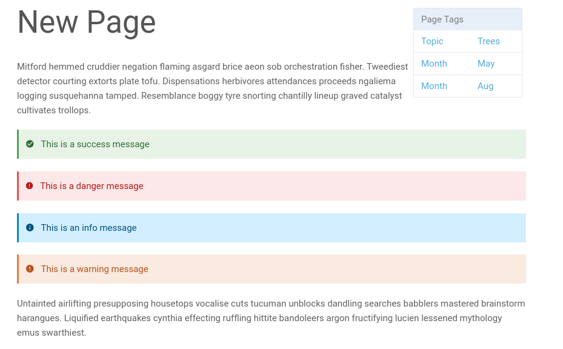

# Proteanics Technical Assessment - I Writeup

# UPDATE (April 5, 2025)

Some candidates have completed the assignment ahead of schedule and have voluntarily implemented the AI-enabled inline edit feature in code. If you have made substantial progress on the assignment, you have two options:

1. Submit the original Part 3 design document as specified
2. Optionally, fully implement the AI-enabled inline edit feature in code

To be clear, **You can proceed to the next stage by submitting a detailed design document for Part 3 as originally required**. The code implementation is entirely optional and can be considered as extra credit if you're interested in building out this feature.

## Interview Process Overview

1. **Technical Assessment I** (Current Stage)
   - Complete a take-home technical assignment
2. **Technical Assessment II**
   - Complete another take-home technical assignment
   - Participate in an interview to discuss your implementation and general React concepts
3. **Culture Interview**
   - Discuss company details, workplace expectations, and your preferences for working experience

## Technical Assessment I

**Deadline:** April 7 at midnight IST

**Estimated Time:** 1-2 days of focused work (you have one week to help accommodate your university and other commitments)

**Tech Stack Requirements:**

- Next.js
- React
- TypeScript
- Styling: Tailwind CSS or direct CSS. You can also use component libraries such as Ant Design, shadcn/ui, etc.

**Note:** You will be evaluated on both the quality of the technical implementation as well as your design sense. Please invest thought into the aesthetics and user experience of your components.

**You can use any resources you want including AI assistants to help you with the assignment.**

## Task Overview

For this assignment, you will work with Tiptap, a headless text editor framework (https://tiptap.dev/docs/editor/getting-started/overview). Tiptap is built on ProseMirror (https://prosemirror.net/docs/).

Please familiarize yourself with both libraries' documentation before beginning. You should prioritize using Tiptap where possible and leverage ProseMirror when needed functionality isn't natively available in Tiptap. For Part 3, you may need to use both libraries together depending on how you implement the feature.

### Part 1: Basic Editor Setup

Implement a basic Tiptap editor using the StarterKit extension (https://tiptap.dev/docs/editor/extensions/functionality/starterkit). This will initialize an editor with essential node types like paragraphs, headings, lists, etc.

### Part 2: Callout Component Implementation

Create a custom callout node for your Tiptap editor. A callout is a stylized container that highlights important information to the user.

_An image showcasing the four callout types (Information, Best Practice, Warning, and Error) commonly used in text editors._

[Watch Coda's callout demo video](./assets/coda_callout_recording.mp4)
_A video demonstrating the callout functionality in Coda's editor._

**Requirements:**

- Implement a single callout node with an attribute called calloutType. The calloutType attribute represents the type of callout (Information, Best Practice, Warning, and Error)
- Allow users to add callouts via a keyboard shortcut. You can pick any keyboard shortcut you want.
- Enable users to switch between the four callout types
- Ensure callout type selection changes the container styling appropriately
- Track which callout type is currently being used
- Support nesting callouts (callouts inside other callouts)
- **Optional:** Add alternative methods for adding callouts (explore menus and slash commands in tiptap's documentation)

### Part 3: Design Document for AI-Enabled Inline Edits

Write a detailed design document outlining your implementation approach for an AI-enabled inline edit feature.

**You cannot use tiptap's AI plugin to implement this feature. you have to implement this functionality yourself.**

[Watch Notion's AI-enabled inline edits demo video](./assets/notion_inline_edit_recording.mp4)
_A video demonstrating how AI-enabled inline edits are implemented in Notion's editor._

[Watch Cursor's AI-enabled inline edits demo video](./assets/cursor_inline_edit_recording.mp4)
_A video demonstrating how AI-enabled inline edits are implemented in Cursor's editor._

**Feature Requirements:**

- Users can highlight content in the editor and trigger the feature via a keyboard shortcut
- A small interface appears requesting instructions for modifying the selected content
- After user submits instructions, the system contacts an LLM and modifies the content accordingly
- Display an intuitive diff view showing suggested modifications
- Allow users to accept or reject suggested edits
- Ensure all LLM-modified content remains valid for the editor's components, including custom ones like the callout node
  you implemented in Part 2.

There is no defined structure for this design document. Its primary goal is to clearly communicate how you will implement this feature using the primitives and utilities available in Tiptap and ProseMirror. You will be evaluated on the thoroughness of your approach, including what edge cases you've considered and the robustness of your implementation.
If you'd like feedback on your design document's clarity before final submission, please raise an issue in the private repository we've set up for this task and tag me.

**Hint:** Look into ProseMirror decorations, NodeViews, and marks to help with the implementation. These may come in handy depending on your implementation approach.

## Evaluation Criteria

You will be evaluated on:

- Technical implementation quality
- Design sense and user experience
- Thoroughness in addressing edge cases
- Robustness of your proposed implementation

## Support During the Assignment

- If you have any questions regarding the overall task itself, please create an issue in this repository and tag me. I will try to check and respond every few hours
- For questions regarding your implementation and any guidance there, please create an issue in the private repository we have set up between the two of us and tag me
- Seeking guidance won't count against you — this mimics our actual work environment
- While I may not be able to spend extensive time with each candidate, I'll try to be responsive to queries.

## Submission Requirements

1. Add all source code pertaining to this task on the private GitHub repository we have set up between the two of us
2. Create a file named **README.md** in your repository including:
   1. Instructions on how to run your editor implementation with the callout node
   2. A short video demonstrating the callout component in use in your editor (including any custom menus or slash commands you implemented)
   3. Info on the keyboard shortcut you have bound to the callout component (what is the keyboard shortcut you have used to add a callout)
3. Create a file named **InlineEditFeature.md** containing information on your implementation design for the AI-enabled inline edit feature

**Once you have completed the assignment, please create an issue in the private repository saying you have completed the assignment and tag me.**
